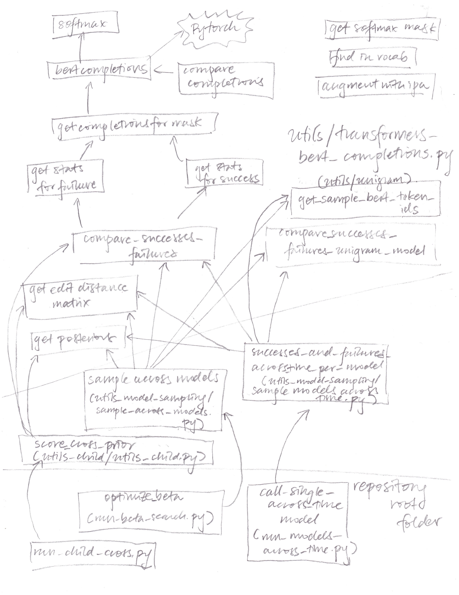

# child-directed-listening

Analyses for "Child Directed Listening" project. 

# Corresponding Publications and Manuscripts
Different hashed versions correspond to three separate publications/manuscripts:

- "How adults understand what young children say," (ms under review) 60881a0e291dabae306081c86894d335e56b1136
- "Child-directed Listening: How Caregiver Inference Enables Children's Early Verbal Communication" (CogSci, 2021), https://arxiv.org/abs/2102.03462v2
778b677629d00f9167df9a493aeaeec9e19492ec
- "Characterizing Child-Directed Listening with Corpus and Model-based Analyses" (ICIS, 2020)  7fe6d22065bd36f936a53f4e3ba706fa127b0811

To check out the codebase at the corresponding point in development, try:

```git checkout <hash>```

# Organization

This codebase assumes that you have a local machine and a SLURM cluster with GPU nodes. The code is separated into three stages:

`tier_1`: On your local machine: Download, transform, and prepare data; enforce data splits; create vocabulary; train WFST model for likelihood
`tier_2`: On a cluster: Train and do inference for all of the models 
`tier_3`: On your local machine: Run analyses on the model results, appropriate to generate the tables and figures in the paper. 

Tiers 1 and 3 are mostly comprised of Jupyter notebooks; invoking the relevant shell scripts will run `nbconvert` to convert notebooks into outputs where all cells have been run. These notebooks can be inspected amd edited.

Tier 1 ends with a shell script that copies all of the data produced in Tier 1 to your cluster. Tier 3 begins with a shell script that copies all of the trained models and model inferences to your local machine.

You need to set up a Python virtual environment, install dependencies, and then configure the virtual machine as a Jupyter kernel for Tier 1 and Tier 3. For Tier 2, you can either set up a virtual machine (unsupported) or use a Singularity virtual machine image. You must clone the repo onto both yur local machine and on to your cluster.


# Environment

Assumes Python 3.8. All requirements should be installed in a virtual enviroment. Make a new environment called `child-directed-listening` with

```virtualenv -p python3.6 child-directed-listening```

Activate it with:

```source child-directed-listening/bin/activate```

And install requirements with: 

```pip3 install -r requirements.txt```

You can then install the virtual environment as a kernel by running the following within the virtual machine.

```pip3 install --user ipykernel ``` 
```python3 -m ipykernel install --user --name=child-directed-listening```


# Using SLURM

Scripts under `tier_2`require a SLURM system with GPU nodes for model training, and relatively high CPU counts for the likelihood (~24 cores). Ideally this SLURM system can also run Singularity virtual machines.  

0. Clone this repository to your local machine and to your SLURM machine. Note the directory on the SLURM machine as this will be `CDL_SLURM_ROOT`
0. Set the following environment variables on **both** your local machine and on the SLURM machine
```
export SLURM_USERNAME="*****@******"  
export CDL_SLURM_USER="smeylan"  
export CDL_SLURM_ROOT="~/om2/python/child-directed-listening"  
export CDL_SINGULARITY_PATH="/om2/user/wongn/vagrant/trans-pytorch-gpu"  
```
Above values are examples. Set them as follows:

`SLURM_USERNAME` is username and domain of the SLURM login node.  
`CDL_SLURM_USER` is the username of the SLURM user  
`CDL_SLURM_ROOT` is the path on the SLURM machine where all results will reside  
`CDL_SINGULARITY_PATH` is the path to the Singularity image on the SLURM machine (with Transformers, pytorch, etc.)  

`sacct -u smeylan`
 
 Take any failed jobs and search for relevant logs with `find . -name "*<jobID>*"`
 
 For interactive debugging, start an interactive session on your cluster with `srun` (e.g., `srun -p cpl -t 24:00:00 --gres=gpu:1  --cpus-per-task=24 --ntasks=1 --constraint=high-capacity --mem=35G --pty bash`) and run the individual commands one by one.  For Python code, you can force the interpreter to drop you into the debugger on failure by using `python3 -m pdb -c c <script contents>`. Move up the stack with `u` until you see some variables that make sense.

To confirm that resource usage is appropriate, run `nvidia-smi` for GPU usage and `htop` for CPU usage

# Running the Code

Once you have your environment configured on your local machine, run `./tier_1_data_gen.sh`. The end of this script starts an rsync job that copies the generated files to the SLURM machine (into the directory `CDL_SLURM_ROOT`); this may require your password.

To kick off tier_2, from your SLURM login node, run `sbatch tier_2a_non_child_train_shelf_scores.sh`. This will generate job scripts and submit jobs to finetune models on CHILDES and Switchboard data,  and run token scoring for models that don't require finetuning (that is, off-the-shelf BERT models, unigrams).
After the computations have fully completed (not after the .sh completes submitting the jobs, but after you have confirmed that the program executed completely), run `sbatch tier_2b_finetune_scores_child_train.sh`, which runs inference with the models newly trained in 2a, and trains child-specific models.
`sbatch tier_2c_child_cross` runs infrence on the the child-specific models trained in 2b. 

Tier 3 is back on your local machine. This scripts starts by using rsync to copy the `output` folder back to your local machine. Tier 3b and 3c include analysis scripts.


# Core code

The key code for extracting probability distributions for the prior can be found in `src/utils/transformers_bert_completions.py`; likelihoods are retrieved in `src/utils/likelihoods`.

Below is an overview of how the token scores are generated:


The top-level functions and function calls are in the following files:

- `run_beta_search.py` does parameter search for the two likelihoods. It calls ``optimize_beta``, which calls ``sample_across_models``. This computes the optimal beta and lambda values within specified search spaces, given a sample of communicative successes. 

- Once the parameter search is over, `run_models_across_time.py` computes scores of tokens from samples that have been drawn across time. It will eventually call `success_and_failures_across_time_per_model`. This function retrieves prior probabilities from BERT models and unigram models as matrices, computes an edit-distance based likelihood (also a matrix), and does element-wise multiplication and row normalization to get the posteriors. It pulls the best hyperparameter value found by `run_beta_search.py`

- `run_child_cross.py` will call ``score_cross_prior``, which will calculate the scores per token similar to the across time and beta functions described above. However, it will do so by loading a model finetuned on a certain child, and data associated with another child (possibly, but not necessarily, different children).


