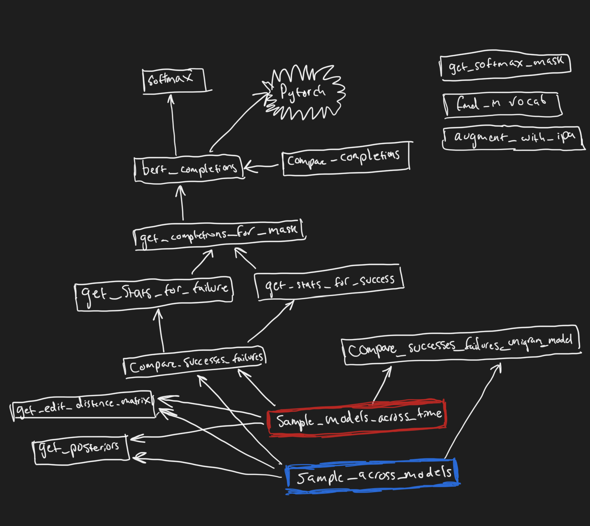

# child-directed-listening
Analyses for "Child Directed Listening" at ICIS 2020 and ``Child-directed Listening: How Caregiver Inference Enables Children's Early Verbal Communication'' submitted to CogSci 2021.

Highly recommended that you install the Python packages in a virtual enviroment and use the virtual environment as a Jupyter kernel.

To download the Providence corpus from PhonBank

```
wget https://phonbank.talkbank.org/phon/Eng-NA/Providence.zip
```
# Retrieving completions from BERT

See `BERT prediction xxx.ipynb`. Helper functions in `transfomers_bert_completions.py` are structured as follows:


Blue and red indicate top-level functions.
